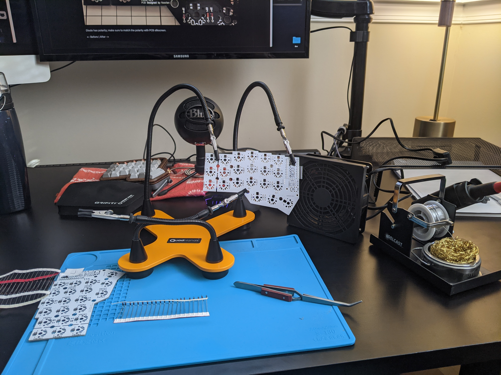
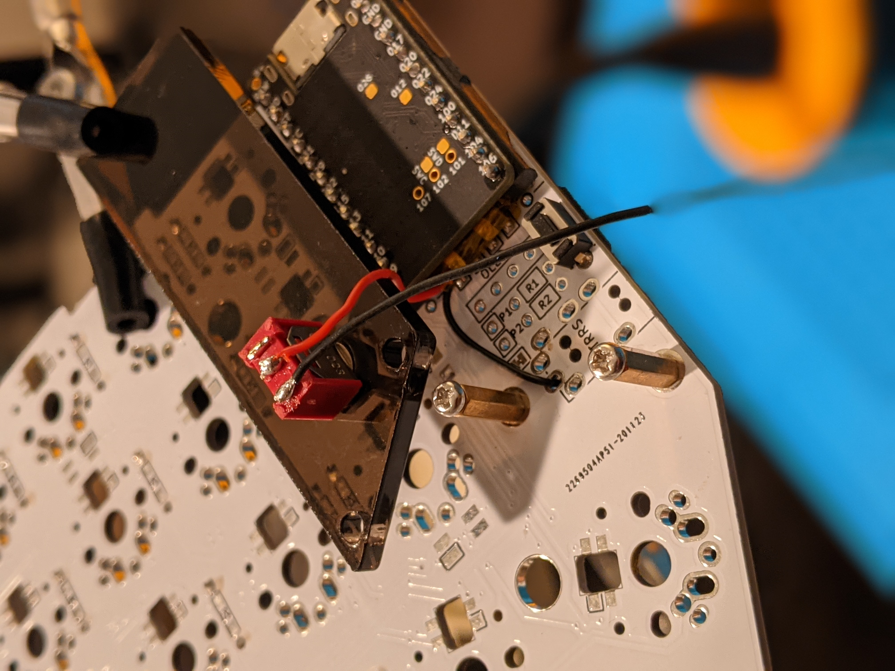
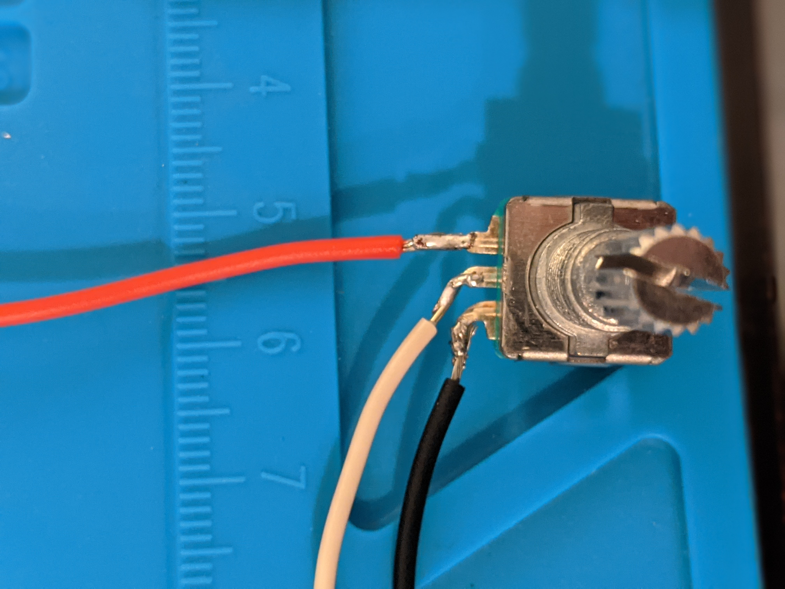
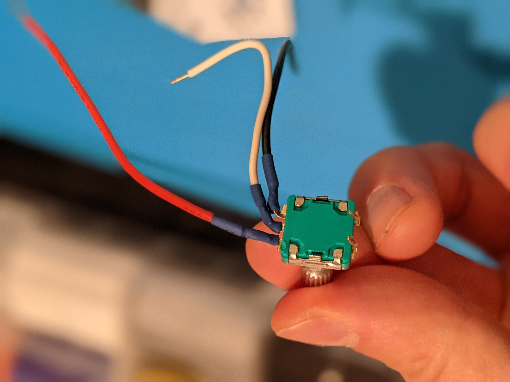
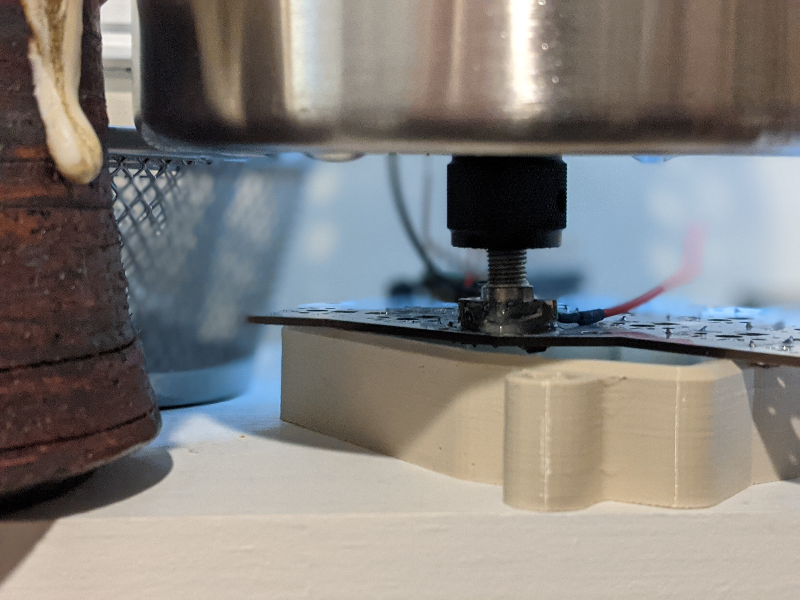
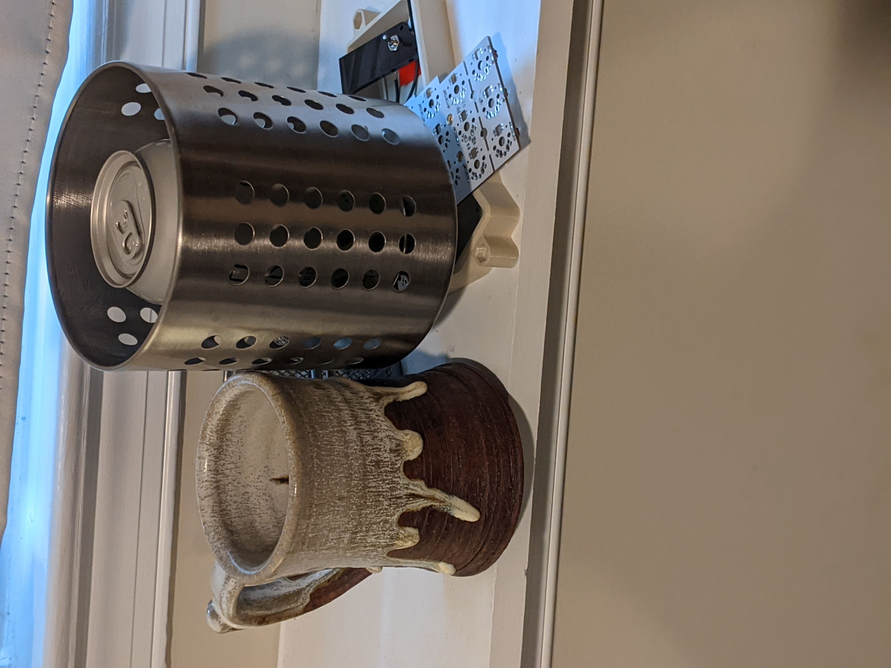
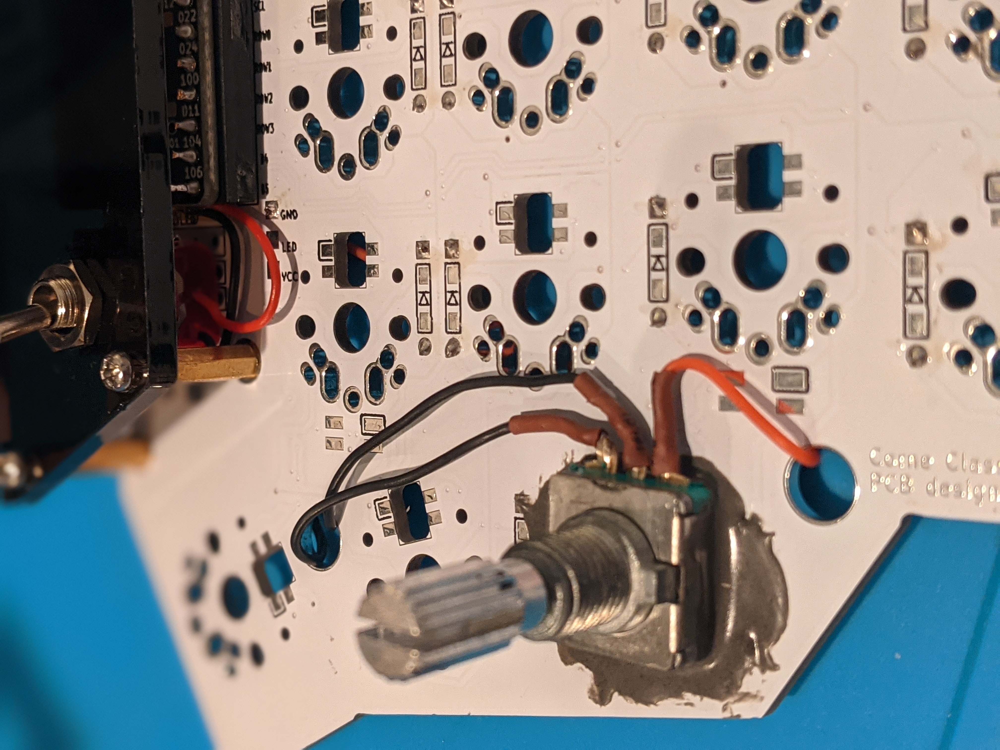

# TOC

- [Parts list](#parts-list)
- [Case](#case)
- [Assembly](#assembly)
- [Firmware](#firmware)

# Parts list

- Corne PCB kit (and diodes) from [keyhive](https://keyhive.xyz/shop)
- 2 [nano!nano controllers](https://docs.nicekeyboards.com/#/) from nice! keyboards
- 2 [Mill-Max sockets](https://www.digikey.at/product-detail/en/mill-max-manufacturing-corp/110-44-624-41-001000/ED90056-ND/947064) and 48 [Mill-Max socket pins](https://www.digikey.be/product-detail/en/mill-max-manufacturing-corp/3320-1-00-15-00-00-03-0/ED1161-ND/4147393) (I bought 100 just to have extras)
- [3D-printed tent case](https://www.thingiverse.com/thing:4705667), printed by [P3D Store](https://p3dstore.com/)
- [M5 nuts & bolts](https://www.amazon.com/gp/product/B07QSFT4ST/) for tent legs
- 41x Boba U4 Switches (62g) from [mkultra.click](https://mkultra.click/)
- [Blank DCS Keycaps](https://pimpmykeyboard.com/dcs-pbt-blank-keysets/) from Pimpmykeyboard (I got the Ergodox Black set)
- 2x [micro toggle switches](https://www.amazon.com/gp/product/B075RDYMQQ/)
- 1x [Encoder knob](https://www.arrow.com/en/products/oedni-75-4-5/kilo-international)

# Case

I designed the [3D tent case](https://www.thingiverse.com/thing:4705667) based on [this wireless Corne case](https://www.thingiverse.com/thing:4598829) by [SilentGmn](https://www.thingiverse.com/silentgmn/designs). It was a simple modification to add M5 bolt mounts. The stl files and f3d file to make it are all available in the [case_files folder](https://github.com/jhelvy/wireless-corne/tree/main/case_files) of this repo.

# Assembly

For the most part, I followed the [Corne build guide](https://github.com/foostan/crkbd/blob/master/corne-classic/doc/buildguide_en.md) by [@foostan](https://github.com/foostan/), which is pretty straight forward. Since this was a wireless build, I did not install the TRRS jacks, and I also opted not to include OLEDs or LEDs (I wanted to conserve battery life as much as possible).

I socketed the nano!nano controllers on each side, following the [documentation](https://nicekeyboards.com/docs/nice-nano/getting-started) on nicekeyboards.com using [these sockets](https://www.digikey.at/product-detail/en/mill-max-manufacturing-corp/110-44-624-41-001000/ED90056-ND/947064) and [these pins](https://www.digikey.be/product-detail/en/mill-max-manufacturing-corp/3320-1-00-15-00-00-03-0/ED1161-ND/4147393). I highly recommend getting thes slightly longer pins rather than using diode legs. These are much stronger and the longer length is easier to install, just clip off the excess after it's mounted.

The two mods I made to this build were:

1. Adding a toggle switch for the battery.
2. Adding a rotary encoder on the right half.

## Battery toggle switch

I wanted to implement some sort of switch so I could turn off the battery when not in use. My strategy was to mount a toggle switch in the OLED cover. I found [these tiny switches](https://www.amazon.com/gp/product/B075RDYMQQ/) on Amazon, and after clipping off the legs they just barely fit between the covers and the PCB when using 10mm stand offs.

I connected the switches following the same strategy as [@petejohanson](https://github.com/petejohanson/)'s [post](https://discord.com/channels/675924128108118016/698923975002292245/784755423012978688) on discord:

- Battery negative attached to GND TRRS pad (wire passed through a TRRS hole and soldered on the back side).
- Battery positive attached to one switch contact.
- Wire from other switch contact to RAW pad on back of Corne PCB (again, wired passed through a hole in the unused TRRS mount.

The toggle switch itself was easily mounted on the OLED cover by just drilling a hole in the cover, pushing the switch top through it, and securing it in place using the bolts that come with the switches.

In the "top" image below, you can see how the battery is connected to the toggle switch. In the "bottom" image, showing the bottom of the PCB, you can see the battery negative coming through a TRRS hole and soldered to the TRRS ground, and a black wire from the toggle switch coming through another TRRS hole and soldered to the RAW pad. The other three wires coming through stand off holes at the bottom are from the rotary encoder.

Top | Bottom
----|----
 | 

## Rotary encoder

To mount the encoder, I first soldered 3 wires to the encoder pins and used heat shrink to keep them extra secure (I later painstakingly removed these wires and replaced them as I found later that these were too thick). I bent the encoder pins a little since I would later route these wires through a couple of the stand off mount holes in the PCB.

Top | Bottom
----|----
 | 

I then glued the encoder over a switch mount using [JB Weld](https://www.jbweld.com/). This stuff makes an incredibly strong seal, and it also doesn't expand while setting. I let it sit over night using a carefully-balanced can of soda water, pencil holder, and mug to keep downward pressure.

Encoder gluing | Weight
----|----
 | 

Once set, I routed the wires through the stand off mounts to the left and right of the encoder, then soldered them to the controller and PCB ground on the bottom of the PCB. The positive and negative leads are soldered to the bottom two opposite pins on the controller (farthest from the USB).

Top | Bottom
----|----
 | 

# Firmware
